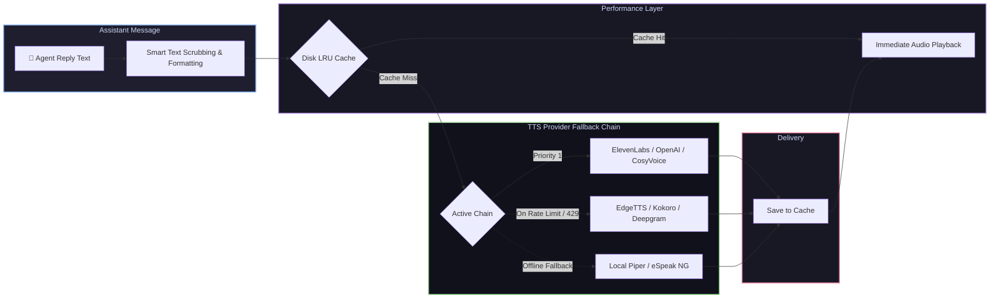

# 📦 @goodandready/dsh-tts

<div align="center">

<h3>Multi-Provider Text-to-Speech Voice Synthesis with Smart Scrubbing & Disk LRU Cache for DeepSeek Harness</h3>

<p align="center">
  <a href="https://www.npmjs.com/package/@goodandready/dsh-tts"></a>
  <a href="LICENSE"></a>
  <a href="https://github.com/topics/dsh-plugin"></a>
  <a href="https://nodejs.org"></a>
</p>

<p align="center">
  <a href="README.md"><b>🇬🇧 English</b></a> •
  <a href="README.ru.md"><b>🇷🇺 Русский</b></a> •
  <a href="README.zh.md"><b>🇨🇳 中文说明</b></a>
</p>

</div>

---

## ⚡ Overview

**`dsh-tts`** provides robust, lifelike spoken voice synthesis for assistant replies in the **DeepSeek Harness** Web UI. When **Speak agent replies** is enabled, each finished assistant turn is synthesized on the host and streamed directly to the browser.

API keys never reach client browsers: synthesis is executed entirely on the host backend across **independent multi-provider fallback chains**.



---

## 🛠️ Complete Supported Providers Matrix (16 Backends)

| Provider Key | Service Backend | Default Model | Default Voice | Credential Ref | Features & Notes |
|---|---|---|---|---|---|
| `elevenlabs` | ElevenLabs API | `eleven_multilingual_v2` | `Rachel` | `ELEVENLABS_API_KEY` | Ultra-realistic, emotional nuance |
| `openai` | OpenAI Audio | `gpt-4o-mini-tts` / `tts-1` | `alloy` | `OPENAI_API_KEY` | High-quality industry standard |
| `edge` | Microsoft Edge Online | `ru-RU-SvetlanaNeural` | `ru-RU-SvetlanaNeural` | *None* | **Free, high-fidelity neural TTS without API keys** |
| `siliconflow` | SiliconFlow CosyVoice | `FunAudioLLM/CosyVoice2-0.5B` | Default | `SILICONFLOW_API_KEY` | State-of-the-art CosyVoice2 neural engine |
| `deepinfra` | DeepInfra Kokoro | `hexgrad/Kokoro-82M` | Default | `DEEPINFRA_API_KEY` | Fast open-weights Kokoro synthesis |
| `fireworks` | Fireworks AI | `kokoro` | Default | `FIREWORKS_API_KEY` | Ultra-low latency Kokoro inference |
| `minimax` | MiniMax Speech | `speech-01-turbo` | Default | `MINIMAX_API_KEY` | High-expressiveness neural voice |
| `mimo` | Xiaomi MiMo Audio | `mimo-v2.5-tts` | Default | `MIMO_API_KEY` | Low-latency streaming TTS |
| `google` | Google Cloud TTS | `gemini-2.5-flash-preview-tts` | Language default | `GEMINI_API_KEY` | Multilingual Google Gemini voice synthesis |
| `azure` | Azure Cognitive Speech | `en-US-JennyNeural` | Region default | `AZURE_SPEECH_KEY` | Enterprise neural synthesis |
| `deepgram` | Deepgram Aura | `aura-asteria-en` | `asteria` | `DEEPGRAM_API_KEY` | Ultra-low latency voice output |
| `groq` | Groq TTS | `playai-tts` | `default` | `GROQ_API_KEY` | Near-instant inference speed |
| `openrouter` | OpenRouter Audio | `openai/gpt-4o-mini-tts` | `alloy` | `OPENROUTER_API_KEY` | Unified router access |
| `custom` | Custom OpenAI-compatible | Configurable | Configurable | `CUSTOM_TTS_API_KEY` | Any `/v1/audio/speech` endpoint |
| `piper` | Local Piper ONNX | Local ONNX weights | Model default | *None* | 100% offline neural engine |
| `espeak` | Local eSpeak NG | System synth | `ru` / `en` | *None* | 100% offline lightweight fallback |

---

## 🧹 Smart Text Scrubbing & Formatting Engine

Before text reaches speech synthesizers, `dsh-tts` intelligently sanitizes and filters the message so the assistant doesn't read out syntax noise:

### 1. Spoken Cue Replacements
Instead of reading 50 lines of Python or raw markdown tables, the plugin substitutes localized natural notices:
* **Fenced Code Blocks**: Spoken as *"code block, N lines"* / *"блок кода, N строк"*.
* **Markdown Tables**: Spoken as *"table, N rows"* / *"таблица, N строк"*.
* **Summary Intros**: Spoken as *"Summary of the reply"* / *"Пересказ ответа"*.

### 2. Narration Filters (`applyNarrationFilters`)
* `skipCode` (`true` by default): Replaces code blocks with short spoken notices.
* `skipActions`: Drops `*asterisk action*` blocks (e.g. `*smiles warmly*`) before synthesis.
* `narrateQuotesOnly`: Speaks only text enclosed within quotation marks.
* `removeRegex`: Custom global regex pattern to strip arbitrary user tags, citations, or timestamps.
* `autoDetect`: Dynamically detects `ru` vs `en` per spoken sentence and switches voices automatically.

---

## 💾 Disk LRU Cache (`createSpeechCache`)

Repeated phrases (e.g. standard greetings, common explanations, or status notices) are automatically hashed by `(text, provider, model, voice)` and cached on disk.
* **Instant Playback**: Zero network latency on cached hits.
* **Cost Savings**: Zero repeat API charges.
* **Configurable Quota**: `cacheMaxMb` (default `100` MB) evicts least-recently-used audio automatically.

---

## 🎭 Role Overrides & Personas

Assign distinct voices, SSML styles, and audio chimes to specific subagents or roles:

```yaml
dsh-tts:
  speakReplies: true
  roleOverrides:
    coder:
      provider: openai
      voice: onyx
    narrator:
      provider: elevenlabs
      voice: Rachel
      ssmlStyle: cheerful
```

---

## 📦 Quick Installation

```bash
dsh plugin --profile web add @goodandready/dsh-tts
```

> [!IMPORTANT]
> Restart DSH Web UI after installation (`systemctl --user restart dsh-web`) and refresh your browser tab.

---

## ⚙️ Configuration Recipes (`settings.yaml`)

### Multi-Provider Fallback (Edge Free → OpenAI → Local Piper)
```yaml
dsh-tts:
  speakReplies: true
  skipCode: true
  cache: true
  cacheMaxMb: 150
  autoDetect: true
  chain:
    - provider: edge
      voice: ru-RU-SvetlanaNeural
    - provider: siliconflow
      model: FunAudioLLM/CosyVoice2-0.5B
    - provider: openai
      model: tts-1
      voice: alloy
    - provider: piper
```

---

## 🤖 HTTP Endpoints & Agent Tools

* `POST /dsh-tts/speak` — `{ text, voice?, model? }` → Streams audio output (`audio/mpeg` or `audio/wav`).
* `GET /dsh-tts/status` — Returns active chain state, cache statistics, and engine readiness.

---

## 📄 License

MIT © [GooDAnDReaDY](https://github.com/GooDAnDReaDY)
