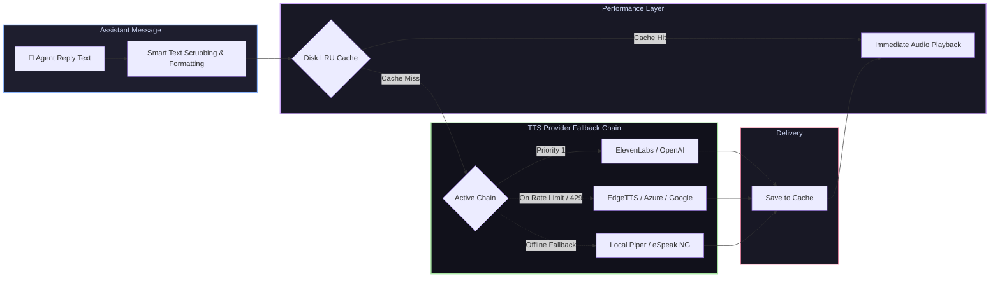

# 📦 @goodandready/dsh-tts

<div align="center">

<h3>Multi-Provider Text-to-Speech Voice Synthesis with Smart Scrubbing & Disk LRU Cache for DeepSeek Harness</h3>

<p align="center">
  <a href="https://www.npmjs.com/package/@goodandready/dsh-tts"></a>
  <a href="LICENSE"></a>
  <a href="https://github.com/topics/dsh-plugin"></a>
  <a href="https://nodejs.org"></a>
</p>

<p align="center">
  <a href="README.md"><b>🇬🇧 English</b></a> •
  <a href="README.ru.md"><b>🇷🇺 Русский</b></a> •
  <a href="README.zh.md"><b>🇨🇳 中文说明</b></a>
</p>

</div>

---

## ⚡ Overview

**`dsh-tts`** provides robust spoken voice synthesis for assistant replies in the **DeepSeek Harness** Web UI. When **Speak agent replies** is enabled, each finished assistant turn is automatically synthesized on the host and streamed to the browser.

API keys never reach client browsers: audio synthesis is executed entirely on the host backend across **independent multi-provider fallback chains**.



---

## ✨ Key Features

* 🔊 **10+ Cloud & Offline TTS Engines**: ElevenLabs, OpenAI Audio, Azure Cognitive, Google Cloud, EdgeTTS (free), Deepgram Aura, Groq TTS, Piper, and eSpeak NG.
* 🛡️ **Failover Fallback Chains**: Reorders providers so API rate limits, network timeouts, or quota exhaustion never leave the assistant silent.
* 🧹 **Smart Text Scrubbing**: Strips fenced code blocks (`skipCode`), markdown syntax, LaTeX formulas, and `*asterisk actions*` (`skipActions`) before synthesis.
* 💾 **Disk LRU Cache**: Configurable disk cache (`cacheMaxMb`, default 100MB) reuses synthesized audio for repeated phrases, eliminating API fees and latency.
* 🎭 **Per-Agent Role Overrides**: Assign custom voices, models, SSML styles, and audio chimes to distinct personas or subagents.
* 🌐 **Dynamic Language Auto-Detection**: Guesses `ru`/`en` per spoken sentence and switches voices on the fly (`autoDetect`).
* 🔒 **Zero Key Leakage**: API credentials resolve securely on the host via `ctx.credentials` (`credentialRef`).

---

## 🛠️ Supported Providers Matrix

| Provider Key | Service Backend | Default Model | Default Voice | Credential Ref | Features & Notes |
|---|---|---|---|---|---|
| `elevenlabs` | ElevenLabs API | `eleven_multilingual_v2` | `Rachel` | `ELEVENLABS_API_KEY` | Ultra-realistic, emotional nuance |
| `openai` | OpenAI Audio | `tts-1` | `alloy` | `OPENAI_API_KEY` | High-quality standard voice |
| `azure` | Azure Cognitive Speech | `neural` | Region specific | `AZURE_SPEECH_KEY` | Enterprise neural synthesis |
| `google` | Google Cloud TTS | `Neural2` | Language default | `GOOGLE_TTS_KEY` | Multilingual neural voices |
| `edgetts` | Microsoft Edge Online | Online Neural | `ru-RU-SvetlanaNeural` / `en-US-JennyNeural` | *None* | **Free, high-fidelity neural TTS without API keys** |
| `deepgram` | Deepgram Aura | `aura-asteria-en` | `asteria` | `DEEPGRAM_API_KEY` | Ultra-low latency voice output |
| `groq` | Groq TTS | Fast inference | `default` | `GROQ_API_KEY` | Near-instant generation |
| `piper` | Local Piper ONNX | Local model | Model default | *None* | 100% offline, lightweight neural engine |
| `espeak` | Local eSpeak NG | System synth | `ru` / `en` | *None* | 100% offline fallback synthesizer |

---

## 🧹 Text Scrubbing & Formatting Options

| Setting | Default | Description |
|---|---|---|
| `speakReplies` | `false` | Automatically synthesize and speak new assistant turns in Web UI |
| `skipCode` | `true` | Replace fenced code blocks with a short spoken cue instead of reading raw syntax |
| `skipActions` | `false` | Drop `*asterisk action*` blocks before synthesis |
| `narrateQuotesOnly` | `false` | Speak only text enclosed in quotation marks |
| `removeRegex` | `""` | Custom global regular expression to strip arbitrary patterns |
| `autoDetect` | `false` | Automatically detect language per phrase (e.g. RU vs EN) |
| `cache` | `true` | Cache synthesized audio on disk |
| `cacheMaxMb` | `100` | Disk cache limit in MB (least-recently-used items evicted first) |

---

## 📦 Quick Installation

```bash
dsh plugin --profile web add @goodandready/dsh-tts
```

> [!IMPORTANT]
> Restart DSH Web UI after installation (`systemctl --user restart dsh-web`) and refresh your browser tab.

---

## ⚙️ Configuration Example (`settings.yaml`)

```yaml
dsh-tts:
  speakReplies: true
  skipCode: true
  cache: true
  cacheMaxMb: 150
  autoDetect: true
  chain:
    - provider: edgetts
      voice: ru-RU-DmitryNeural
    - provider: openai
      model: tts-1
      voice: onyx
    - provider: piper
```

---

## 🤖 HTTP Endpoints & Agent Tool

* `POST /dsh-tts/speak` — `{ text, voice?, model? }` → Streams audio output (`audio/mpeg` or `audio/wav`).
* `GET /dsh-tts/status` — Returns active chain state, cache statistics, and engine readiness.

---

## 📄 License

MIT © [GooDAnDReaDY](https://github.com/GooDAnDReaDY)
