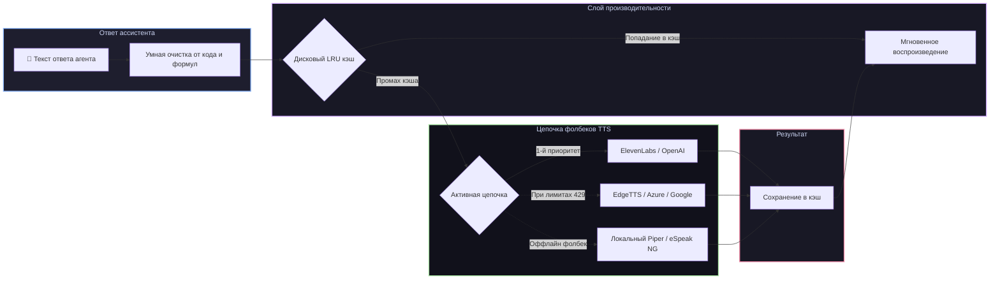

# 📦 @goodandready/dsh-tts

<div align="center">

<h3>Озвучивание ответов агента через 10+ TTS-провайдеров с умной фильтрацией и кэшированием на диске для DeepSeek Harness</h3>

<p align="center">
  <a href="https://www.npmjs.com/package/@goodandready/dsh-tts"></a>
  <a href="LICENSE"></a>
  <a href="https://github.com/topics/dsh-plugin"></a>
  <a href="https://nodejs.org"></a>
</p>

<p align="center">
  <a href="README.md"><b>🇬🇧 English</b></a> •
  <a href="README.ru.md"><b>🇷🇺 Русский</b></a> •
  <a href="README.zh.md"><b>🇨🇳 中文说明</b></a>
</p>

</div>

---

## ⚡ Обзор

**`dsh-tts`** обеспечивает качественное голосовое озвучивание ответов ассистента в веб-интерфейсе **DeepSeek Harness**. При включённой опции **Озвучивать ответы агента**, каждая готовая реплика синтезируется на хосте и воспроизводится в браузере.

API-ключи никогда не передаются в браузер: синтез аудио выполняется на стороне хоста через **независимые цепочки отказоустойчивости (фолбеков)**.



---

## ✨ Ключевые возможности

* 🔊 **10+ TTS-движков**: ElevenLabs, OpenAI Audio, Azure Cognitive, Google Cloud, EdgeTTS (бесплатно без ключей), Deepgram Aura, Groq TTS, Piper и eSpeak NG.
* 🛡️ **Цепочки отказоустойчивости**: автоматический перебор провайдеров, чтобы исчерпание лимитов или сбои сети не оставляли агента безмолвным.
* 🧹 **Умная очистка текста**: замена блоков кода (`skipCode`), разметки Markdown, формул LaTeX и действий в звёздочках (`skipActions`) на краткие голосовые уведомления.
* 💾 **Дисковый LRU-кэш**: сохранение аудио повторных фраз на диске (`cacheMaxMb`, по умолчанию 100 МБ) с вытеснением старых записей.
* 🎭 **Индивидуальные роли**: назначение разных голосов, моделей и SSML-стилей разным субагентам и персонажам.
* 🌐 **Автоопределение языка**: динамическое определение `ru`/`en` для каждой фразы и переключение голоса на лету (`autoDetect`).
* 🔒 **Безопасность**: ключи читаются через сервис `ctx.credentials` на хосте.

---

## 🛠️ Матрица поддерживаемых провайдеров

| Ключ | Сервис | Модель по умолчанию | Голос по умолчанию | Переменная ключа | Особенности |
|---|---|---|---|---|---|
| `elevenlabs` | ElevenLabs API | `eleven_multilingual_v2` | `Rachel` | `ELEVENLABS_API_KEY` | Сверхреалистичный эмоциональный синтез |
| `openai` | OpenAI Audio | `tts-1` | `alloy` | `OPENAI_API_KEY` | Качественный стандартный голос |
| `azure` | Azure Cognitive Speech | `neural` | по региону | `AZURE_SPEECH_KEY` | Корпоративные нейронные голоса |
| `google` | Google Cloud TTS | `Neural2` | по языку | `GOOGLE_TTS_KEY` | Многоязычные нейросети Google |
| `edgetts` | Microsoft Edge Online | Online Neural | `ru-RU-SvetlanaNeural` | *Не требуется* | **Бесплатный высококачественный нейронный синтез без API-ключей** |
| `deepgram` | Deepgram Aura | `aura-asteria-en` | `asteria` | `DEEPGRAM_API_KEY` | Сверхнизкая задержка вывода речи |
| `groq` | Groq TTS | Быстрый инференс | `default` | `GROQ_API_KEY` | Мгновенная генерация |
| `piper` | Локальный Piper ONNX | Локальная модель | из модели | *Не требуется* | 100% оффлайн нейронный движок |
| `espeak` | Локальный eSpeak NG | Системный синтез | `ru` / `en` | *Не требуется* | 100% оффлайн базовый синтезатор |

---

## 🧹 Параметры фильтрации и озвучивания

| Параметр | По умолчанию | Описание |
|---|---|---|
| `speakReplies` | `false` | Автоматически озвучивать новые ответы ассистента в Web UI |
| `skipCode` | `true` | Заменять блоки кода коротким голосовым уведомлением вместо зачитывания синтаксиса |
| `skipActions` | `false` | Пропускать действия в звёздочках (`*действие*`) |
| `narrateQuotesOnly` | `false` | Озвучивать только текст внутри кавычек |
| `removeRegex` | `""` | Пользовательское регулярное выражение для удаления шаблонов |
| `autoDetect` | `false` | Автоматически определять язык каждой фразы |
| `cache` | `true` | Кэшировать синтезированное аудио на диске |
| `cacheMaxMb` | `100` | Лимит размера дискового кэша в МБ (LRU вытеснение) |

---

## 📦 Быстрая установка

```bash
dsh plugin --profile web add @goodandready/dsh-tts
```

---

## ⚙️ Пример конфигурации (`settings.yaml`)

```yaml
dsh-tts:
  speakReplies: true
  skipCode: true
  cache: true
  cacheMaxMb: 150
  autoDetect: true
  chain:
    - provider: edgetts
      voice: ru-RU-DmitryNeural
    - provider: openai
      model: tts-1
      voice: onyx
    - provider: piper
```

---

## 📄 Лицензия

MIT © [GooDAnDReaDY](https://github.com/GooDAnDReaDY)
