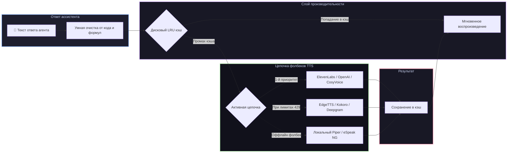

# 📦 @goodandready/dsh-tts

<div align="center">

<h3>Озвучивание ответов агента через 16 TTS-провайдеров с умной фильтрацией и кэшированием на диске для DeepSeek Harness</h3>

<p align="center">
  <a href="https://www.npmjs.com/package/@goodandready/dsh-tts"></a>
  <a href="LICENSE"></a>
  <a href="https://github.com/topics/dsh-plugin"></a>
  <a href="https://nodejs.org"></a>
</p>

<p align="center">
  <a href="README.md"><b>🇬🇧 English</b></a> •
  <a href="README.ru.md"><b>🇷🇺 Русский</b></a> •
  <a href="README.zh.md"><b>🇨🇳 中文说明</b></a>
</p>

</div>

---

## ⚡ Обзор

**`dsh-tts`** обеспечивает качественное голосовое озвучивание ответов ассистента в веб-интерфейсе **DeepSeek Harness**. При включённой опции **Озвучивать ответы агента**, каждая готовая реплика синтезируется на хосте и воспроизводится в браузере.

API-ключи никогда не передаются в браузер: синтез аудио выполняется на стороне хоста через **независимые цепочки отказоустойчивости (фолбеков)**.



---

## 🛠️ Полная матрица поддерживаемых провайдеров (16 бэкендов)

| Ключ | Сервис | Модель по умолчанию | Голос по умолчанию | Переменная ключа | Особенности |
|---|---|---|---|---|---|
| `elevenlabs` | ElevenLabs API | `eleven_multilingual_v2` | `Rachel` | `ELEVENLABS_API_KEY` | Сверхреалистичный эмоциональный синтез |
| `openai` | OpenAI Audio | `gpt-4o-mini-tts` / `tts-1` | `alloy` | `OPENAI_API_KEY` | Качественный стандартный голос |
| `edge` | Microsoft Edge Online | `ru-RU-SvetlanaNeural` | `ru-RU-SvetlanaNeural` | *Не требуется* | **Бесплатный высококачественный нейронный синтез без API-ключей** |
| `siliconflow` | SiliconFlow CosyVoice | `FunAudioLLM/CosyVoice2-0.5B` | по умолчанию | `SILICONFLOW_API_KEY` | Передовая нейросеть CosyVoice2 |
| `deepinfra` | DeepInfra Kokoro | `hexgrad/Kokoro-82M` | по умолчанию | `DEEPINFRA_API_KEY` | Быстрый инференс модели Kokoro-82M |
| `fireworks` | Fireworks AI | `kokoro` | по умолчанию | `FIREWORKS_API_KEY` | Сверхнизкая задержка Kokoro |
| `minimax` | MiniMax Speech | `speech-01-turbo` | по умолчанию | `MINIMAX_API_KEY` | Высокоэмоциональный синтез |
| `mimo` | Xiaomi MiMo Audio | `mimo-v2.5-tts` | по умолчанию | `MIMO_API_KEY` | Потоковый синтез речи |
| `google` | Google Cloud TTS | `gemini-2.5-flash-preview-tts` | по языку | `GEMINI_API_KEY` | Многоязычные нейросети Google Gemini |
| `azure` | Azure Cognitive Speech | `en-US-JennyNeural` | по региону | `AZURE_SPEECH_KEY` | Корпоративные нейронные голоса |
| `deepgram` | Deepgram Aura | `aura-asteria-en` | `asteria` | `DEEPGRAM_API_KEY` | Сверхнизкая задержка вывода речи |
| `groq` | Groq TTS | `playai-tts` | `default` | `GROQ_API_KEY` | Мгновенная генерация речи |
| `openrouter` | OpenRouter Audio | `openai/gpt-4o-mini-tts` | `alloy` | `OPENROUTER_API_KEY` | Унифицированный доступ через роутер |
| `custom` | Пользовательский OpenAI | Настраивается | Настраивается | `CUSTOM_TTS_API_KEY` | Любой `/v1/audio/speech` эндпоинт |
| `piper` | Локальный Piper ONNX | Локальная модель | из модели | *Не требуется* | 100% оффлайн нейронный движок |
| `espeak` | Локальный eSpeak NG | Системный синтез | `ru` / `en` | *Не требуется* | 100% оффлайн базовый синтезатор |

---

## 🧹 Движок умной фильтрации и очистки текста

Перед передачей текста в TTS-движки `dsh-tts` очищает его от синтаксического шума:

### 1. Голосовые уведомления вместо кода
* **Блоки кода**: заменяются голосовой фразой *"блок кода, N строк"* / *"code block, N lines"*.
* **Таблицы**: озвучиваются как *"таблица, N строк"* / *"table, N rows"*.
* **Пересказы**: предваряются фразой *"Пересказ ответа"*.

### 2. Фильтры наррации (`applyNarrationFilters`)
* `skipCode` (`true` по умолчанию): заменяет блоки кода на короткие голосовые уведомления.
* `skipActions`: вырезает действия в звёздочках (`*улыбается*`) перед синтезом.
* `narrateQuotesOnly`: озвучивает только текст внутри кавычек.
* `removeRegex`: пользовательская регулярка для удаления тегов, ссылок или временных меток.
* `autoDetect`: автоопределение языка фразы (`ru`/`en`) и переключение голоса на лету.

---

## 💾 Дисковый LRU-кэш (`createSpeechCache`)

Повторяющиеся фразы автоматически хэшируются по `(текст, провайдер, модель, голос)` и сохраняются на диск:
* **Мгновенный ответ**: нулевая задержка сети при попадании в кэш.
* **Экономия баланса**: ноль повторных списаний за одинаковые фразы.
* **Лимит размера**: параметр `cacheMaxMb` (по умолчанию `100` МБ) автоматически вытесняет самые давние записи.

---

## 🎭 Переопределение ролей

Назначение индивидуальных голосов, моделей и SSML-стилей разным агентам:

```yaml
dsh-tts:
  speakReplies: true
  roleOverrides:
    coder:
      provider: openai
      voice: onyx
    narrator:
      provider: elevenlabs
      voice: Rachel
```

---

## 📦 Быстрая установка

```bash
dsh plugin --profile web add @goodandready/dsh-tts
```

---

## ⚙️ Пример конфигурации (`settings.yaml`)

```yaml
dsh-tts:
  speakReplies: true
  skipCode: true
  cache: true
  cacheMaxMb: 150
  autoDetect: true
  chain:
    - provider: edge
      voice: ru-RU-SvetlanaNeural
    - provider: siliconflow
      model: FunAudioLLM/CosyVoice2-0.5B
    - provider: openai
      model: tts-1
      voice: alloy
    - provider: piper
```

---

## 📄 Лицензия

MIT © [GooDAnDReaDY](https://github.com/GooDAnDReaDY)
