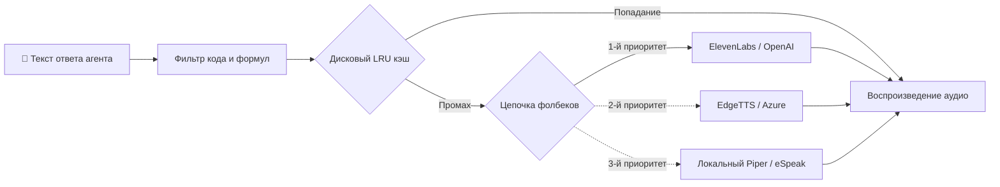

# 📦 @goodandready/dsh-tts

<div align="center">

<h3>Озвучивание ответов агента через 10+ TTS-провайдеров с кэшированием на диске</h3>

<p align="center">
  <a href="https://www.npmjs.com/package/@goodandready/dsh-tts"></a>
  <a href="LICENSE"></a>
  <a href="https://github.com/topics/dsh-plugin"></a>
  <a href="https://nodejs.org"></a>
</p>

<p align="center">
  <a href="README.md"><b>🇬🇧 English</b></a> •
  <a href="README.ru.md"><b>🇷🇺 Русский</b></a> •
  <a href="README.zh.md"><b>🇨🇳 中文说明</b></a>
</p>

</div>

---

## ⚡ Обзор

**`dsh-tts`** озвучивает ответы ассистента в веб-интерфейсе **DeepSeek Harness** через цепочку из 10+ облачных и оффлайн TTS-движков с умной фильтрацией синтаксиса и LRU-кэшированием на диске.



---

## ✨ Ключевые возможности

* 🔊 **10+ TTS движков**: ElevenLabs, OpenAI, Azure, Google Cloud, EdgeTTS (бесплатно), Deepgram, Groq, Piper, eSpeak.
* 🧹 **Очистка от шума**: заменяет блоки кода и формулы на голосовые ремарки, не зачитывая синтаксис.
* 💾 **Дисковый LRU-кэш**: повторные фразы мгновенно берутся из кэша, экономя баланс API.
* 🎭 **Индивидуальные роли**: назначение голосов и стилей конкретным агентам.

---

## 📦 Быстрая установка

```bash
dsh plugin --profile web add @goodandready/dsh-tts
```

---

## 📄 Лицензия

MIT © [GooDAnDReaDY](https://github.com/GooDAnDReaDY)
