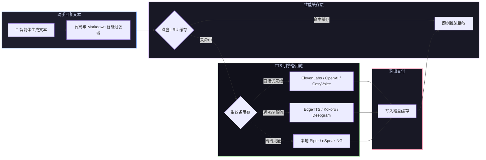

# 📦 @goodandready/dsh-tts

<div align="center">

<h3>DeepSeek Harness 智能体多引擎语音合成与磁盘 LRU 缓存插件</h3>

<p align="center">
  <a href="https://www.npmjs.com/package/@goodandready/dsh-tts"></a>
  <a href="LICENSE"></a>
  <a href="https://github.com/topics/dsh-plugin"></a>
  <a href="https://nodejs.org"></a>
</p>

<p align="center">
  <a href="README.md"><b>🇬🇧 English</b></a> •
  <a href="README.ru.md"><b>🇷🇺 Русский</b></a> •
  <a href="README.zh.md"><b>🇨🇳 中文说明</b></a>
</p>

</div>

---

## ⚡ 插件概览

**`dsh-tts`** 为 **DeepSeek Harness** Web 界面提供高保真智能体回复语音朗读服务。开启 **朗读智能体回复** 后，每条生成的助手回复均由服务端合成并实时推流至浏览器播放。

API 密钥绝不暴露给前端：音频合成全程在服务端通过**多服务商独立备用链**执行。



---

## 🛠️ 支持的 16 大服务商矩阵

| 服务商 Key | 对应引擎 | 默认模型 | 默认发音人 | 凭证变量名 | 说明与亮点 |
|---|---|---|---|---|---|
| `elevenlabs` | ElevenLabs API | `eleven_multilingual_v2` | `Rachel` | `ELEVENLABS_API_KEY` | 极致拟人情感音色 |
| `openai` | OpenAI Audio | `gpt-4o-mini-tts` / `tts-1` | `alloy` | `OPENAI_API_KEY` | 经典高清发音 |
| `edge` | 微软 Edge 在线 | `zh-CN-XiaoxiaoNeural` | `zh-CN-XiaoxiaoNeural` | *无需密钥* | **免费免 Key 高保真神经网络语音** |
| `siliconflow` | 硅基流动 CosyVoice | `FunAudioLLM/CosyVoice2-0.5B` | 默认 | `SILICONFLOW_API_KEY` | SOTA 级别 CosyVoice2 语音大模型 |
| `deepinfra` | DeepInfra Kokoro | `hexgrad/Kokoro-82M` | 默认 | `DEEPINFRA_API_KEY` | 极速轻量 Kokoro-82M 开源引擎 |
| `fireworks` | Fireworks AI | `kokoro` | 默认 | `FIREWORKS_API_KEY` | 毫秒级 Kokoro 推理服务 |
| `minimax` | MiniMax Speech | `speech-01-turbo` | 默认 | `MINIMAX_API_KEY` | 高表现力中文旗舰发音 |
| `mimo` | 小米 MiMo Audio | `mimo-v2.5-tts` | 默认 | `MIMO_API_KEY` | 低延迟流式语音 |
| `google` | Google Cloud TTS | `gemini-2.5-flash-preview-tts` | 语种默认 | `GEMINI_API_KEY` | 谷歌 Gemini 多语种神经网络合成 |
| `azure` | Azure 认知语音 | `en-US-JennyNeural` | 区域默认 | `AZURE_SPEECH_KEY` | 企业级神经网络发音人 |
| `deepgram` | Deepgram Aura | `aura-asteria-en` | `asteria` | `DEEPGRAM_API_KEY` | 极低延迟英文输出 |
| `groq` | Groq TTS | `playai-tts` | `default` | `GROQ_API_KEY` | 极速推理 |
| `openrouter` | OpenRouter Audio | `openai/gpt-4o-mini-tts` | `alloy` | `OPENROUTER_API_KEY` | 统一路由器通道 |
| `custom` | 自定义 OpenAI 规范 | 可配置 | 可配置 | `CUSTOM_TTS_API_KEY` | 任意兼容 `/v1/audio/speech` 接口 |
| `piper` | 本地 Piper ONNX | 本地 ONNX 权重 | 模型默认 | *无需密钥* | 100% 离线轻量级神经网络引擎 |
| `espeak` | 本地 eSpeak NG | 系统合成器 | `zh` / `en` | *无需密钥* | 100% 离线轻量兜底 |

---

## 📦 安装指南

```bash
dsh plugin --profile web add @goodandready/dsh-tts
```

---

## 📄 开源协议

MIT © [GooDAnDReaDY](https://github.com/GooDAnDReaDY)
